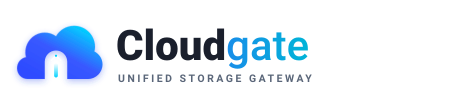

<div align="center">



### Lightweight Unified Cloud Storage Gateway & Multi-Account Aggregator

[](https://golang.org)
[](LICENSE)
[](https://github.com/herliansyah/cloudgate/releases)
[](#architecture--codebase-layout)
[](#testing)

**A single static Go binary with an embedded Google Drive-inspired dark-mode Web UI, REST API, and CLI.**

[Key Features](#key-features) • [Supported Providers](#supported-providers) • [Quick Start](#quick-start) • [Architecture](#architecture--codebase-layout) • [Author](#author--maintainer) • [License](#license)

[English](README.md) | [Bahasa Indonesia](README.id.md)

</div>

---

## Key Features

1. **Multi-Account Aggregator**: Connect multiple personal, team, and server accounts across 16 supported providers and protocols:
   - **Cloud Drives**: Google Drive, Microsoft OneDrive, Dropbox, Box, pCloud, Yandex Disk, Koofr
   - **Privacy & Encrypted Clouds**: MEGA, Filen, Proton Drive, PikPak
   - **Object Storage & Server Protocols**: Amazon S3, Backblaze B2, Nextcloud / WebDAV, SFTP, SMB (Windows Share / Samba)
2. **Capacity-Aware StoragePool**: Combine multiple storage accounts into a unified virtual pool where incoming writes are automatically distributed using capacity-aware round-robin without splitting intact files.
3. **Async Background Task Queue & Folder Transfers**: Persistent 2-worker FIFO queue in SQLite for long-running file transfers and recursive directory trees with restart recovery and cancellation.
4. **Direct Remote Ingest (URL Download to Cloud)**: Zero-disk streaming pipeline fetching web resources (HTTP/HTTPS) directly into any cloud drive with strict SSRF network protection.
5. **Folder Replication & Sync**: Cross-account directory synchronization with additive and mirror modes (orphans soft-deleted into isolated `RemoteTrash`).
6. **Zero-Disk Streaming Transfers**: Perform direct cross-account file copy and move operations via in-memory `io.Pipe` streaming with zero temporary host disk footprint and verified safe-move semantics.
7. **Isolated Remote Trash**: Soft-delete files into an isolated remote directory (`/.cloudgate_trash/`) with a local SQLite catalog mapping original paths for deterministic one-click restoration.
8. **Local SQLite Architecture**: Powered by pure-Go SQLite (`modernc.org/sqlite`) for zero-CGO static compilation, featuring an FTS5 full-text search index, bounded 100-record task rolling window, and an atomic 100-event rolling audit log.
9. **Encrypted Vault & GitHub Sync**: Secure account configurations and credentials with PBKDF2 + AES-256-GCM encryption, with optional synchronization to private GitHub repositories.
10. **Single-Instance Mutex & Port Hunting**: Automatically acquires an OS lock file (`~/.config/cloudgate/cloudgate.lock`) to prevent duplicate processes, and scans available ports starting at `5210` (`5210..5300`) listening on `0.0.0.0` for local and LAN access.
11. **Automated Self-Update & Offline Changelog**: Built-in GitHub Releases updater checks for official releases, strictly verifies SHA-256 checksums against `checksums.txt`, applies in-place binary upgrades, and performs graceful in-process restarts (`ProcessRestart`) with embedded offline changelog viewing (`cloudgate changelog` and `cloudgate update`).
12. **Bilingual UI & Documentation**: Seamless instant toggle between English and Bahasa Indonesia with persisted preferences and synchronized bilingual documentation.

---

## Supported Providers

Cloudgate connects to **16 storage providers and protocols**. Every provider is served by an **embedded rclone v1.73 backend** (`github.com/rclone/rclone/backend/*`) compiled into the single binary, so pagination, chunked/resumable uploads, token refresh and provider quirks are handled by rclone. No external rclone binary or daemon is needed.

| Provider | Category | Auth Method | rclone backend | What you need |
| :--- | :--- | :--- | :--- | :--- |
| **Google Drive** | Cloud Drive | OAuth 2.0 | `drive` | Your own Client ID / Secret ([Guide](#google-drive-integration-guide)) |
| **Microsoft OneDrive** | Cloud Drive | OAuth 2.0 | `onedrive` | Your own Client ID / Secret (Entra ID app) |
| **Dropbox** | Cloud Drive | OAuth 2.0 (offline) | `dropbox` | Your own App key / App secret |
| **Box** | Cloud Drive | OAuth 2.0 | `box` | Your own Client ID / Secret |
| **pCloud** (US & EU) | Cloud Drive | OAuth 2.0 | `pcloud` | Your own Client ID / Secret |
| **Yandex Disk** | Cloud Drive | OAuth 2.0 | `yandex` | Your own ClientID / Client secret |
| **Koofr** | Cloud Drive | Direct Credentials | `koofr` | Email & **app password** |
| **MEGA** | Privacy Cloud | Direct Credentials | `mega` | Email, password (+ OTP secret if 2FA) |
| **Filen** | Privacy Cloud | Direct Credentials | `filen` | Email, password & **API key** (Filen CLI) |
| **Proton Drive** | Privacy Cloud | Direct Credentials | `protondrive` | Username, password (+ OTP secret / 2FA code, mailbox password) |
| **PikPak** | Privacy Cloud | Direct Credentials | `pikpak` | Email/phone & password |
| **Amazon S3 & S3-compatible** (R2, Wasabi, MinIO, ...) | Object Storage | Access Keys (SigV4) | `s3` | Access key ID, secret, bucket, region, endpoint |
| **Backblaze B2** | Object Storage | Application Key | `b2` | keyID, applicationKey, bucket |
| **Nextcloud / WebDAV** | Protocol / Cloud | Direct Credentials | `webdav` | URL, username, (app) password |
| **SFTP** | Server Protocol | SSH Credentials | `sftp` | Host, port, user, password or private key (host key pinned on first use) |
| **SMB (Samba / Windows)** | Server Protocol | Network Share | `smb` | Host, share, user, password |

Uploads and downloads are streamed through rclone. When the upload size is unknown and the backend cannot stream, Cloudgate spools the upload to a temporary file first.

Every account is verified against the real provider before it is saved, and rotated credentials (OAuth refresh tokens, Proton/PikPak sessions, OneDrive drive IDs, SFTP host keys) are written back to the local database automatically.

<!-- Web UI Preview Placeholder (e.g. docs/assets/cloudgate-preview.png) -->

---

## Quick Start

### 1. Download Pre-compiled Binary (Recommended)

Download the latest static binary for your operating system and architecture from [GitHub Releases](https://github.com/herliansyah/cloudgate/releases):

```bash
# Example for Linux (make executable and run)
chmod +x cloudgate
./cloudgate serve
```

### 2. Or Build from Source

Requirements: Go 1.22+

```bash
# Clone the repository
git clone https://github.com/herliansyah/cloudgate.git
cd cloudgate

# Build single static binary with embedded web assets
go build -o bin/cloudgate cmd/cloudgate/main.go
```

### 3. Or Run with Docker / Docker Compose

Cloudgate is packaged as a minimal, secure multi-architecture container image (`linux/amd64`, `linux/arm64`) on GitHub Container Registry:

#### Using Docker Run:
```bash
docker run -d \
  --name cloudgate \
  --restart unless-stopped \
  -p 5210:5210 \
  -v $(pwd)/data:/data \
  ghcr.io/herliansyah/cloudgate:latest
```

#### Using Docker Compose:
```yaml
services:
  cloudgate:
    image: ghcr.io/herliansyah/cloudgate:latest
    container_name: cloudgate
    restart: unless-stopped
    ports:
      - "5210:5210"
    volumes:
      - ./data:/data
    environment:
      - CLOUDGATE_CONFIG_DIR=/data
```
Run:
```bash
docker compose up -d
```

> [!TIP]
> **Headless / Remote Docker Setup**:
> If deploying on a remote VPS or headless Docker host, initialize your MasterPassword via the container CLI:
> ```bash
> docker exec -it cloudgate cloudgate auth setup "your-secure-master-password"
> ```

### 4. Run Server (Native Binary)

```bash
# Start gateway server (defaults to 0.0.0.0:5210)
./bin/cloudgate serve

# Custom host or starting port
./bin/cloudgate serve --host 0.0.0.0 --port 5210
```

Access the Web UI in your browser:
- Local: `http://localhost:5210` (or `http://127.0.0.1:5210`)
- LAN / Other Devices: `http://<your-lan-ip>:5210`

> [!IMPORTANT]
> **First-Run GatewayAuth Security (MasterPassword)**:
> Cloudgate enforces a mandatory administrative `MasterPassword` on first launch. For security, initializing the password via the Web UI is strictly restricted to loopback (`localhost` / `127.0.0.1`).
> If deploying on a headless server or remote VPS, configure your password via the CLI first before accessing the Web UI remotely:
> ```bash
> ./bin/cloudgate auth setup "your-secure-master-password"
> ```

### 5. CLI Utilities & Self-Update

```bash
# Check and apply latest version update from GitHub Releases
./bin/cloudgate update

# Apply update automatically without interactive prompt
./bin/cloudgate update -y

# Read embedded human-readable release changelog offline
./bin/cloudgate changelog

# Inspect GatewayAuth status or reset password
./bin/cloudgate auth status
./bin/cloudgate auth reset
```

---

## Connecting Cloud Providers

Cloudgate connects to providers via two authentication methods:

1. **Direct Credential & Server Protocol Providers** (Instant Setup):
   - **Supported**: Koofr, MEGA, Filen, Proton Drive, PikPak, Amazon S3 / S3-compatible, Backblaze B2, Nextcloud / WebDAV, SFTP, SMB (Windows Share / Samba).
   - **How to connect**: In the Web UI, click **"+ Add Account"**, select the provider, and enter your login credentials, API key, or server address directly. No external developer registration is required.
2. **OAuth Delegated Providers** (App Consent):
   - **Supported**: Google Drive, Microsoft OneDrive, Dropbox, Box, pCloud, Yandex Disk.
   - **How to connect**: Register your own OAuth app with the provider and paste its Client ID & Secret. The Add Account dialog and the in-app **Docs** page show the exact redirect URI for your gateway address. Follow the walkthrough below for Google Drive as a reference.
   - **Redirect URI rules**: Google rejects private LAN IPs, so for Google Cloudgate uses `http://localhost:<port>/...` when accessed via a LAN IP (finish the sign-in on the Cloudgate machine). Microsoft Entra ID, Dropbox and Box only accept plain `http://` for `localhost`; for access from other devices serve Cloudgate over HTTPS.

---

## Google Drive Integration Guide

To connect a personal or corporate Google Drive account:

### 1. Enable Google Drive API (Mandatory)
In your Google Cloud project, the Google Drive API must be enabled:
- Visit [Google Drive API Overview](https://console.developers.google.com/apis/api/drive.googleapis.com/overview).
- Click **"ENABLE"** (Aktifkan).

### 2. Configure the Google Auth Platform
- Open [Google Auth Platform](https://console.cloud.google.com/auth/overview) and click **Get started**: set the app name and support email, and choose audience **External**.
- Under **Audience → Test users**, add every Google account you will connect (required while the app is in *Testing*; otherwise sign-in fails with `403 access_denied`).
- While the app is in *Testing*, Google expires refresh tokens after 7 days. Publish the app for a long-lived connection.

### 3. Create OAuth 2.0 Credentials
- Open **Clients → Create client** in the Google Auth Platform.
- Select **Web application** (Desktop clients cannot use this redirect URI).
- Under **Authorized redirect URIs**, add the URI shown in the Cloudgate Add Account dialog, for the default port:
  ```
  http://localhost:5210/api/auth/google/callback
  ```
  (If Cloudgate picked another port in `5210..5300`, use that port.)
- Copy the generated **Client ID** and **Client Secret**.

### 4. Connect in Cloudgate
- In the Cloudgate Web UI, click **"+ Add Account"**.
- Select **Google Drive**.
- Paste your **Client ID** and **Client Secret**.
- Click **"Sign in with Google Drive Account"** and approve access.
- Cloudgate completes the token exchange (with PKCE), verifies access, reads your real storage quota, and lists your files.

---

## CLI Reference

```
cloudgate                  Start server on 0.0.0.0:5210 and open Web UI
cloudgate serve            Start server in current terminal
  --host string            Host IP to bind (default "0.0.0.0")
  --port int               Starting port (default 5210, auto-hunts if occupied)
cloudgate accounts         List connected cloud storage accounts
cloudgate audit            View recent 100 audit events
cloudgate auth status     Check GatewayAuth protection status
cloudgate auth setup <pw>  Set initial MasterPassword from terminal
cloudgate auth reset       Reset MasterPassword and return to setup state
cloudgate version          Show version and author information
cloudgate help             Show command help
```

---

## Architecture & Codebase Layout

```
.
├── cmd/cloudgate/         # Main binary entrypoint and CLI commands
├── pkg/
│   ├── auth/              # OAuth2 consent URL generation, token exchange, & bcrypt MasterPassword
│   ├── config/            # Config path resolver & single-instance lockfile
│   ├── db/                # Pure-Go SQLite schema, migrations, & FTS5 search
│   ├── server/            # REST API, static asset server, & port hunting
│   ├── storage/           # Vendor drivers (GDriveDriver), StoragePool, Trash, Transfers
│   ├── sync/              # Encrypted vault GitHub synchronization
│   ├── updater/           # GitHub Releases version checking & updates
│   └── vault/             # PBKDF2 + AES-256-GCM encrypted vault
├── web/                   # Embedded SPA frontend (Google Drive dark-mode UI)
├── docs/
│   ├── adr/               # Architectural Decision Records (0001 - 0024)
│   └── agents/            # Domain conventions and agent triage specifications
├── CONTEXT.md             # Canonical ubiquitous language and domain glossary
└── AGENTS.md              # Agent behavioral rules and skill map
```

---

## Testing

Run the full automated test suite:

```bash
go test -v ./pkg/...
```

---

## Author & Maintainer

Created with ❤️ by **Herliansyah**
- **GitHub**: [@herliansyah](https://github.com/herliansyah)
- **Repository**: [https://github.com/herliansyah/cloudgate](https://github.com/herliansyah/cloudgate)
- **Sponsor / Donate**: [https://saweria.co/herliansyah26](https://saweria.co/herliansyah26)

Contributions, feature suggestions, and bug reports are warmly welcome!

---

## License

This project is licensed under the [MIT License](LICENSE).
Copyright &copy; 2026 Herliansyah.

